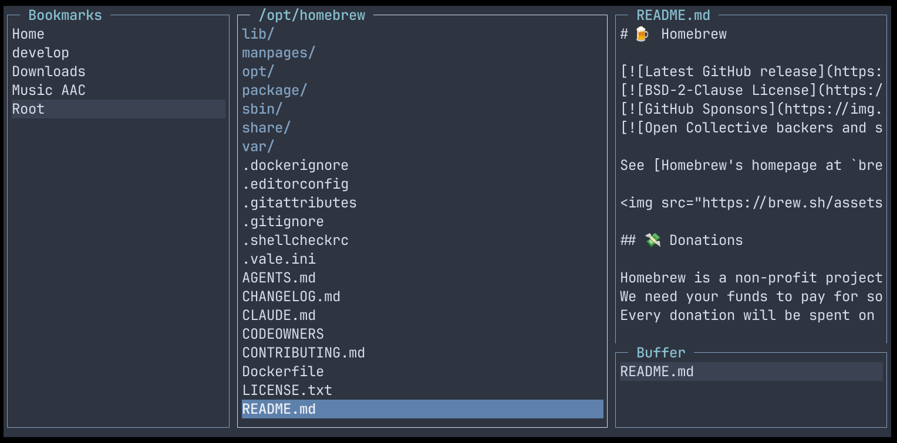

# pathfinder

A terminal file browser with bookmarks.

## Features

- Three-pane layout: bookmarks, file list, preview
- File and directory preview in the right pane
- Buffer pane for staging files to move or copy
- Persistent bookmarks saved to the OS config directory (`~/Library/Application Support/pathfinder/bookmarks.json` on macOS, `~/.config/pathfinder/bookmarks.json` on Linux)

## Key Bindings

### Navigation

| Key | Action |
|-----|--------|
| `Tab` | Cycle focus between bookmarks, file list, and buffer |
| `↑` / `↓` | Move cursor |
| `→` / `Enter` | Enter directory / open file |
| `←` | Navigate to parent directory |
| `PgUp` / `PgDn` | Page up / down |
| `Home` / `End` | Jump to top / bottom |

### File Operations

| Key | Action |
|-----|--------|
| `b` | Add selected file/directory to buffer (file list) / remove from buffer (buffer pane) |
| `m` | Move buffered files to current directory |
| `c` | Copy buffered files to current directory |
| `t` | Move selected item to trash |
| `r` | Rename selected item |
| `n` | Create new directory |
| `o` | Open file with default application |

### Bookmarks

| Key | Action |
|-----|--------|
| `a` | Add current directory to bookmarks |
| `t` | Delete selected bookmark |
| `r` | Rename selected bookmark |
| `Shift+↑` / `Shift+↓` | Reorder bookmarks |

### Other

| Key | Action |
|-----|--------|
| `q` / `Ctrl+C` | Quit |

## Requirements

- Go 1.21+
